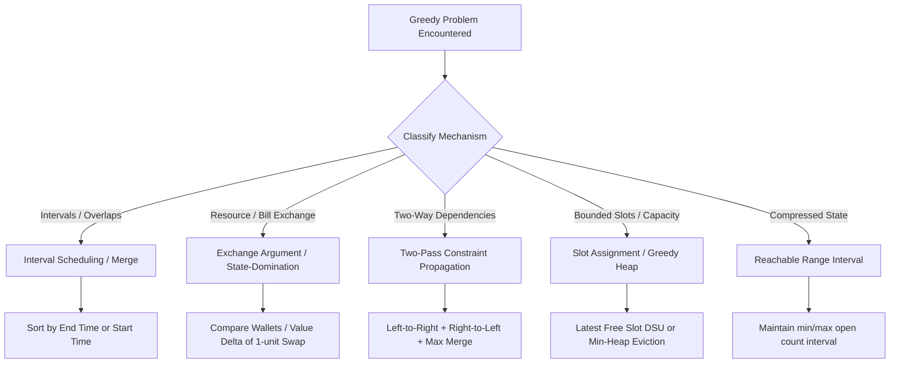

# Interview Prep: Sprint State & DSA Greedy Module Guide

> [!NOTE]
> **Cycle Position**: Day 38 of 30-Day Sprint (Extended to 2026-11-30 for DSA End-to-End Coverage).  
> **Active Focus**: Weekend Spaced-Repetition Batch 2 (Reviews only, cap 12) + Greedy Coverage Queue.  
> **Master Trackers**: [dashboard.md](file:///~/InterviewPrep/Progress/dashboard.md) · [30day-sprint.md](file:///~/InterviewPrep/Progress/30day-sprint.md) · [review_schedule.md](file:///~/InterviewPrep/DSA/Progress/review_schedule.md) · [Greedy.md](file:///~/InterviewPrep/DSA/topics/Greedy.md)

---

## 1. Executive Sprint Status & Review Architecture

### Review Queue & Active Policy
- **Policy**: Weekdays are 100% coverage (daily `+1` review was removed 2026-08-12). Weekends run 2 capped review batches of max 12 problems each.
- **Graduation Standard**: 2 consecutive fully clean reviews at Review #3+ permanently graduates a problem off the ladder.

### Critical Leeches (Daily Short Recall)

| Problem | Tag | Current State | Exact Test Questions & Focus |
| :--- | :--- | :--- | :--- |
| **Bellman-Ford Algorithm** | `[derive]` `[leech]` | 0/2 Clean | 1. *Does Bellman-Ford work on graphs with negative edges? What does a V-th round improvement mean?* (Answer: Negative cycle). 2. *Can a shortest path repeat a node? Therefore, how many edges at most?* (Answer: $V-1$). |
| **Redundant Connection** | `[derive]` `[leech]` | 0/2 Clean | 1. *Which single operation reads rank?* (Answer: `union`, to decide parent/child). 2. *Is an inflated rank a correctness bug or a cost bug?* (Answer: Cost only; tree height increases, degrading $O(\alpha(N))$ toward $O(\log N)$). |
| **Task Scheduler (LC 621)** | `[derive]` `[leech]` | 1/2 Clean | 1. State the closed form: $\max(\text{tasks.length}, (\text{maxFreq} - 1) \times (n + 1) + \text{countMax})$. 2. Justify both terms and the $\max$ clamp. |

---

## 2. DSA Greedy Module: Pattern Taxonomy & Proof Frameworks

### The 4 Proof Shapes for "Why Greedy Works"

> [!IMPORTANT]
> A valid justification cannot simply restate the objective (e.g., *"we pick the max because we want max value"* is circular). It must instantiate an explicit rival choice and compute the non-negative delta.

#### A. The Greedy Exchange Argument (Value Swap)
- **Applicable To**: Fractional Knapsack, Job Sequencing, Assign Cookies.
- **Structure**:
  1. **Assume an Optimal Plan $O$** that deviates from Greedy choice $G$ at the first step.
  2. **Perform an Explicit Swap**: Replace $O$'s choice with $G$'s choice.
  3. **Measure the Delta**: $\Delta \text{Value} = \text{Value}(G) - \text{Value}(O) \ge 0$.
  4. **Conclude**: The modified plan remains valid and is at least as optimal as $O$.

#### B. State-Domination Swap (Resource Availability)
- **Applicable To**: Lemonade Change (LC 860).
- **Key Insight**: Compare the post-transaction inventory directly.
  - Giving $\$10 + \$5$ leaves you with extra $\$5$ bills compared to giving $\$5 + \$5 + \$5$.
  - A $\$5$ bill can satisfy any future transaction that a $\$10$ bill can satisfy, plus $\$10$ transactions that $\$10$ bills cannot satisfy. Thus, holding $\$5$ dominates holding $\$10$.

#### C. Earliest-End / Horizon Maximization
- **Applicable To**: N Meetings in One Room, Non-overlapping Intervals (LC 435), Jump Game (LC 55).
- **Key Insight**: Picking the candidate that finishes earliest ($e_i \le e_j$) strictly leaves maximum remaining time window for subsequent intervals $[e_i, \infty) \supseteq [e_j, \infty)$.

#### D. Two-Pass Constraint Propagation
- **Applicable To**: Candy (LC 135).
- **Key Insight**: Left-pass satisfies $arr[i] > arr[i-1]$; right-pass satisfies $arr[i] > arr[i+1]$. Taking $\max(\text{left}[i], \text{right}[i])$ preserves both inequalities simultaneously because increasing a value never violates a strict greater-than condition over smaller neighbors.

---

## 3. Greedy Problem Inventory & Status Log

| Problem | Type / Pattern | Status | Time | Space | Key Invariant & Live Watchpoints |
| :--- | :--- | :--- | :--- | :--- | :--- |
| **Non-overlapping Intervals** (LC 435) | Interval Scheduling | Solved (`hints:1`) | $O(N \log N)$ | $O(N)$ | Sort by end time (or start time + earliest-end keep). `int[][]` is an object array $\rightarrow$ TimSort $O(N)$ space. |
| **Merge Intervals** (LC 56) | Interval Merging | Solved (`clean`) | $O(N \log N)$ | $O(N)$ | Sort by start time. Merge into `last` interval in-place. Tie-break by end is dead code. |
| **Shortest Job First** (GFG) | Optimal Queue | Solved (`clean`) | $O(N \log N)$ | $O(\log N)$ | Shortest burst first minimizes prefix sums $\sum_{i=1}^N (N - i) \cdot bt[i]$. Primitive `int[]` sort $\rightarrow O(\log N)$. |
| **Assign Cookies** (LC 455) | Two-Pointer Greedy | Solved (`clean`) | $O(N \log N + M \log M)$ | $O(\log N)$ | Sort both; satisfy smallest possible greed with smallest sufficient cookie. |
| **Lemonade Change** (LC 860) | State Domination | Solved (`hints:1`) | $O(N)$ | $O(1)$ | Customer order is fixed (do not sort!). Prefer spending $\$10 + \$5$ over $3 \times \$5$ on $\$20$. |
| **Valid Parenthesis String** (LC 678) | Reachable Interval | Solved (`hints:many`) | $O(N)$ | $O(N)$ | Maintain `[min_open, max_open]`. Prune `min < 0` to 0. Accept if `min == 0`. |
| **Candy** (LC 135) | Two-Pass Propagation | Solved (`hints:many`) | $O(N)$ | $O(N)$ | Left-to-right pass + right-to-left pass merged via `max`. |
| **Fractional Knapsack** (GFG) | Value-Density Greedy | Solved (`hints:several`) | $O(N \log N)$ | $O(N)$ | Sort by value/weight ratio descending. Take full items, then fraction of last item. |
| **Job Sequencing Problem** | Slot Assignment / DSU | Solved (`hints:2`) | $O(N \log N)$ or $O(N \cdot \alpha(N))$ | $O(N)$ | Sort by profit descending. Place in latest available slot $\le$ deadline using DSU path compression. |
| **Jump Game I & II** (LC 55, 45) | Max-Reach Greedy | Solved (`clean`) | $O(N)$ | $O(1)$ | Track `maxReach` and current window boundary `curEnd`. |
| **Insert Interval** (LC 57) | Interval Insertion | Queued | $O(N)$ | $O(N)$ | Left disjoint parts $\rightarrow$ merge overlapping $\rightarrow$ right disjoint parts. |

---

## 4. Standing Traps & Checklist Items

> [!WARNING]
> **Checklist for Every Greedy & Interval Problem**:
> 1. **Primitive vs Object Sort Space**: `int[]` sorts via Dual-Pivot Quicksort ($O(\log N)$ space). `Integer[]` or `int[][]` sorts via TimSort ($O(N)$ space buffer).
> 2. **State Meaning First**: If maintaining a compressed state (`[min, max]` interval, counter, heap), state what the bounds range over before writing mechanics.
> 3. **Trace vs Guessing**: When debugging a test case, trace values step-by-step through the code instead of guessing and patching lines.
> 4. **Sequence vs Set**: Never sort an input if arrival order is part of the problem constraint (e.g., streaming events, customer queues).
